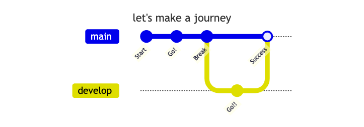

<h1 style="text-align:center">Hi 👋, I'm Nguyen Trong Toan</h1>
<h3 style="text-align:center">A passionate new grad software engineer</h3>

    

> <q>Work your plan, build, and be ***consistent***. You will be fine.</q>
>

## Introduction

- My clear **goal**: Software engineer.
- I love to discover technology. Working in Microsoft and Google is my dream job.
- Would to thank Satoshi, who brings technology to me.
- I’m learning so hard on **frontend** and  **backend**, include data visualization.
- I am building this [page](http://trongtoannguyen.me) to show my knowledge about technology.

## Skills

- Java,C, Python, HTML/CSS, SQL
- Git, Unix-like command, Docker, Vim
- API design, relational databases, OOP, Clean Code, Design Pattern, Debugging, Algorithms, Problem solving, Critical thinking

<!-- ## Experience -->

<!-- ### Projects -->

## Contact me

- [linkedin.com](https://www.linkedin.com/in/trong-toan-nguyen-24583024a/)

- [email: trongtoan1609ht@gmail.com](mailto:trongtoan1609ht@gmail.com)

### 🌐 Website

I have a personal website, you can visit at [trongtoannguyen.me](http://trongtoannguyen.me).
